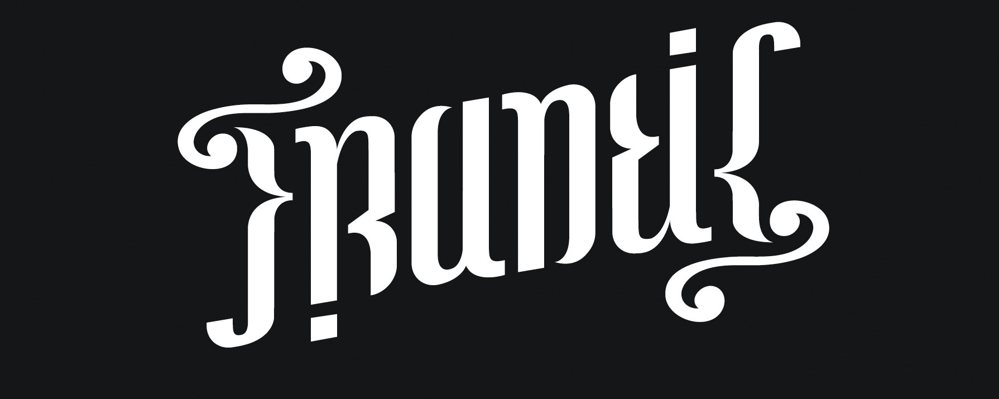
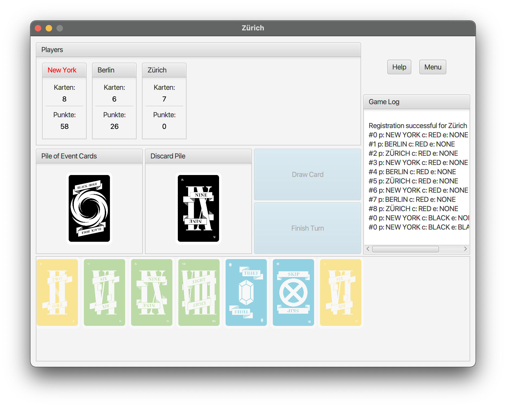

# Frantic®
The Lucky Seven

## [Getting started](Ressources/Installation.Guide.pdf)

## Team

* [**Erman Zankov**](https://github.zhaw.ch/zankoerm) - Ressource Manager aka Skyscraper

* [**Gökhan Bag**](https://github.zhaw.ch/baggoe) - Head of Development aka walking StackOverflow

* [**Joel Plambeck**](https://github.zhaw.ch/plambjoe) - First Executive Programmer aka Dätschmeister

* [**Lukas Zoss**](https://github.zhaw.ch/zossluk1) - Assistant Project Manager aka Made in China

* [**Nikita Smailov**](https://github.zhaw.ch/smailnik) - Competitive Analysis Specialist aka The Lucky One

* [**Samuel Stalder**](https://github.zhaw.ch/staldsam) - Project Manager aka Master of Disaster

* [**Tobias Ritscher**](https://github.zhaw.ch/ritsctob) - Senior Software Engineer specialized in Frantic® Mechanics aka Diseased Penguin

## License 
This project is licensed under the ZHAW License - see [ZHAW](http://www.zhaw.ch) for details.

## [Manual](Ressources/Regeln_Gesamtuebersicht_EN.pdf)

## Screenshot

## Conventions
* [Branch modelling](https://github.zhaw.ch/staldsam/PM3-HS20-IT19a_ZH-Team3/wiki/Git-Branching-Model)
* [Git message convention](https://github.zhaw.ch/staldsam/PM3-HS20-IT19a_ZH-Team3/wiki/Git-Commit-Message-Convention)
